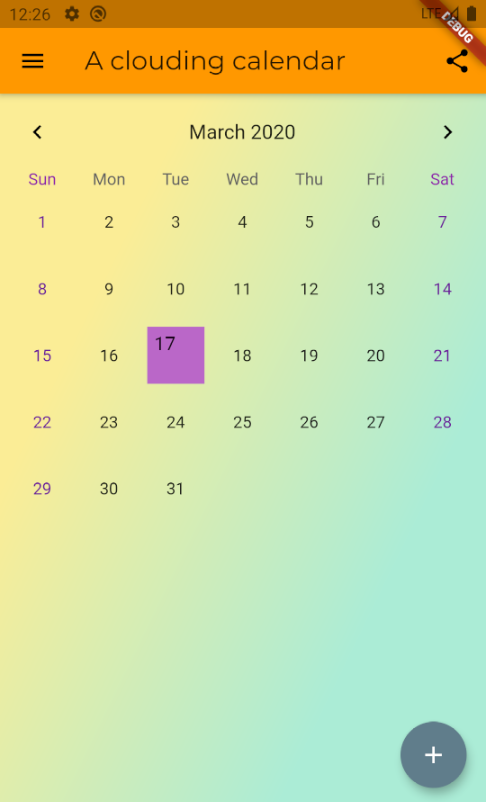
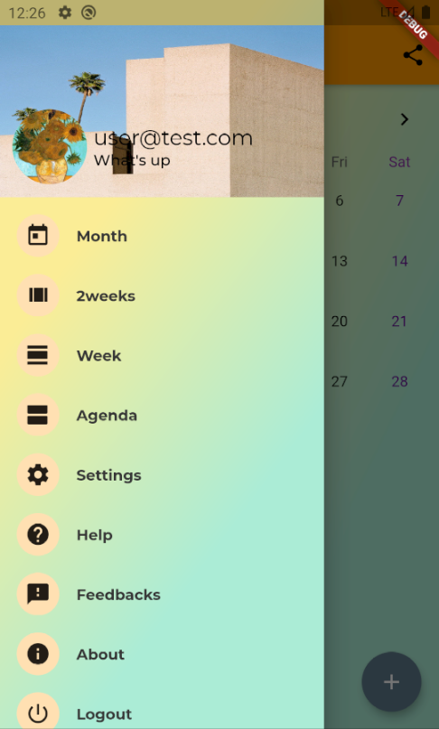
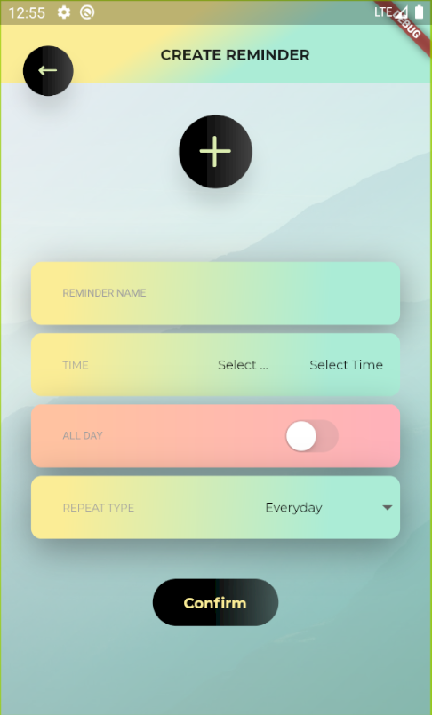
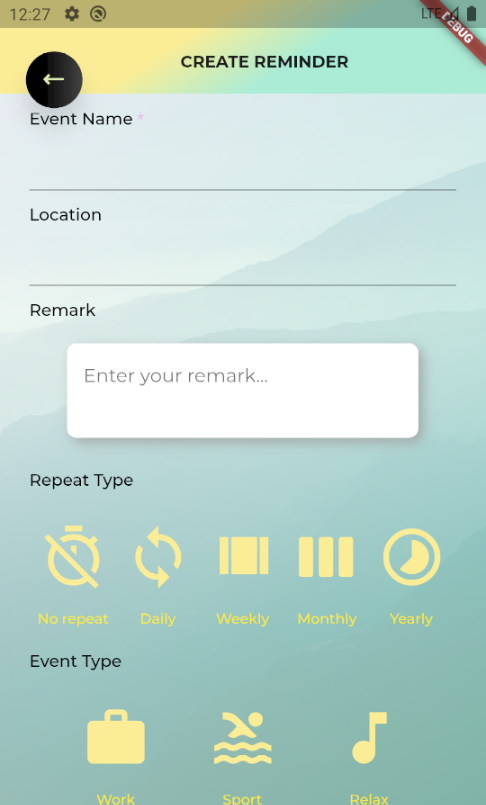

# Zalendar
 
## An Android calendar application using Flutter.

This is the front-end code for this application. The back-end uses Spring Boot framework and it is provided in the repository: Zalendar-back-end.

This is my final year project in university.

### Some screenshots
   